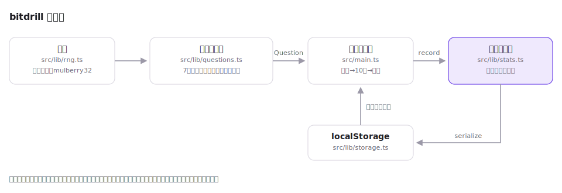

# bitdrill

[](https://github.com/miruky/bitdrill/actions/workflows/ci.yml)
[](https://github.com/miruky/bitdrill/actions/workflows/deploy.yml)
[](https://www.typescriptlang.org/)
[](https://opensource.org/licenses/MIT)

**2進数・16進数の変換とビット演算を、10問1セットで体に覚え込ませる反復トレーニング**

## 概要

bitdrill は、基数変換とビット演算の暗算を鍛えるドリルである。出題は「2進から10進」「10進から16進」「2進と16進の相互」「AND・OR・XOR」「シフト」など7分野で、4ビット(0〜15)と8ビット(0〜255)の2段階から選べる。1セット10問。答えるたびに正誤と解き方の説明が返り、終わると間違えた問題の振り返りが並ぶ。分野ごとの挑戦数と正答率はlocalStorageに積み上がるので、弱い分野が一目で分かる。

採点は表記に寛容で、`0b1010`・`00001010`・`1010` はどれも同じ値として扱い、16進は `0x` の有無や大文字小文字を問わない。値が合っているかだけを見る。

公開先: https://miruky.github.io/bitdrill/

### なぜ作ったのか

ビット演算やサブネットマスクの計算は、仕組みを理解した「つもり」と、手が止まらず出てくる状態の間に大きな差がある。埋めるのは反復しかないが、紙のドリルは答え合わせが面倒で、続かない。即時に採点と解説が返り、成績が残り、すきま時間にブラウザで開けるものが欲しかった。

## アーキテクチャ



出題生成・採点・成績集計はDOMに依存しない純粋なロジックで、乱数はシード付き(mulberry32)のため同じシードから同じ問題が再現できる。テストは問題文を逆解析して答えと突き合わせる方式で、全分野について「問題文に書かれた計算をすると必ず答えになる」ことを機械的に検証している。

## 技術スタック

| カテゴリ             | 技術                                  |
| :------------------- | :------------------------------------ |
| 言語                 | TypeScript 5(strict、実行時依存なし)  |
| ビルド               | Vite 6                                |
| テスト               | Vitest 2 + happy-dom                  |
| リンタ・フォーマッタ | ESLint 9(typescript-eslint)+ Prettier |
| CI / 配信            | GitHub Actions + GitHub Pages         |

## 使い方

分野とビット幅を選んで「10問はじめる」。答えを入力してEnterを押すと、正誤と説明が出る。

| 分野            | 例                                                  |
| :-------------- | :-------------------------------------------------- |
| 2進から10進     | `0010 1101 を10進数で` → `45`                       |
| 10進から2進     | `45 を2進数で(8ビット)` → `00101101`(前置0は省略可) |
| 16進から10進    | `0x2D を10進数で` → `45`                            |
| 10進から16進    | `45 を16進数で` → `2D`(`0x2d` でも可)               |
| 2進と16進の相互 | 4ビット区切りと16進1桁の対応                        |
| AND・OR・XOR    | `1100 AND 1010 を2進数で` → `1000`                  |
| シフト          | `0011 << 2 を2進数で` → `1100`                      |

シフトの出題は、左シフトがビット幅からあふれず、右シフトの結果が0にならない範囲に調整される。負数(2の補数)・乗除算・回転シフトは扱わない。まず無符号の世界で手を速くするための道具である。

## プロジェクト構成

- `src/lib/` — DOM非依存のロジック。シード付き乱数(`rng.ts`)、出題生成と採点(`questions.ts`)、成績集計(`stats.ts`)、保存(`storage.ts`)
- `src/main.ts` — 画面の組み立てと進行(設定 → ドリル → 結果)
- `docs/` — 構成図
- `public/` — ロゴ・ファビコン
- `.github/workflows/` — CI(lint・テスト・ビルド)とGitHub Pagesへのデプロイ

## はじめ方

### 前提条件

Node.js 22以上。

### セットアップ

```bash
git clone https://github.com/miruky/bitdrill.git
cd bitdrill
npm ci
npm run dev
```

### テストの実行

```bash
npm test
```

### Lintの実行

```bash
npm run lint
```

### ビルドとデプロイ

```bash
npm run build
```

GitHub Pagesのようにサブパスへ配信する場合は `BITDRILL_BASE=/bitdrill/` を付けてビルドする。`main` へのpushで `deploy.yml` がビルドとPagesへの反映まで行う。

## 設計方針

- **出題は決定的に再現できる** — 乱数をシード付きにし、出題生成を純関数にした。「同じシードなら同じ問題」が成り立つので、生成ロジックの欠陥(シフトのあふれ等)を大量のシードで網羅的に検査できる。
- **問題文が唯一の仕様** — テストは問題文を正規表現で読み取り、そこに書かれた計算を実行して答えと比べる。生成側と検証側が同じ式を共有しないため、片方の間違いがもう片方で打ち消されない。
- **採点は値だけを見る** — 前置0・`0b`/`0x`・大文字小文字・空白で減点しない。訓練したいのは表記法ではなく値の感覚だからである。
- **間違いを資産にする** — 不正解の直後に解き方を示し、セット終了時にも振り返りを並べ、分野別正答率として残す。

## ライセンス

[MIT](LICENSE)
